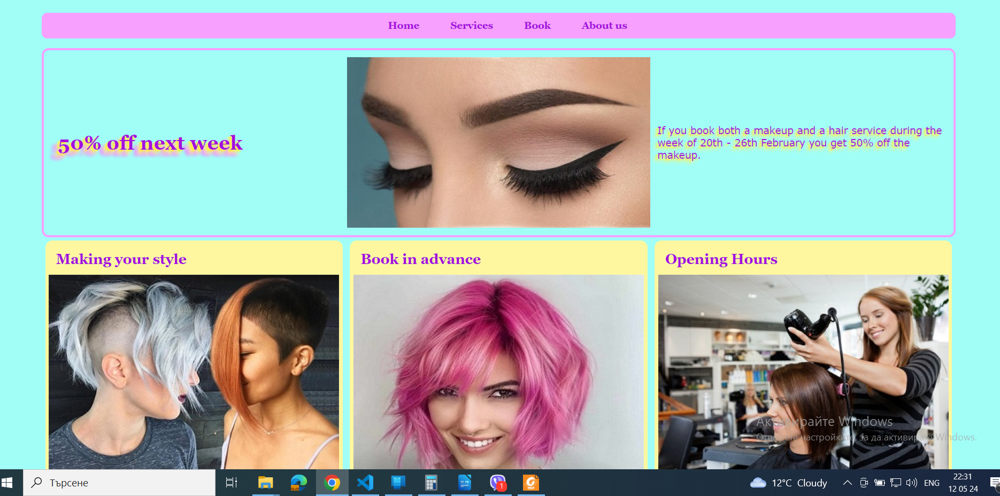
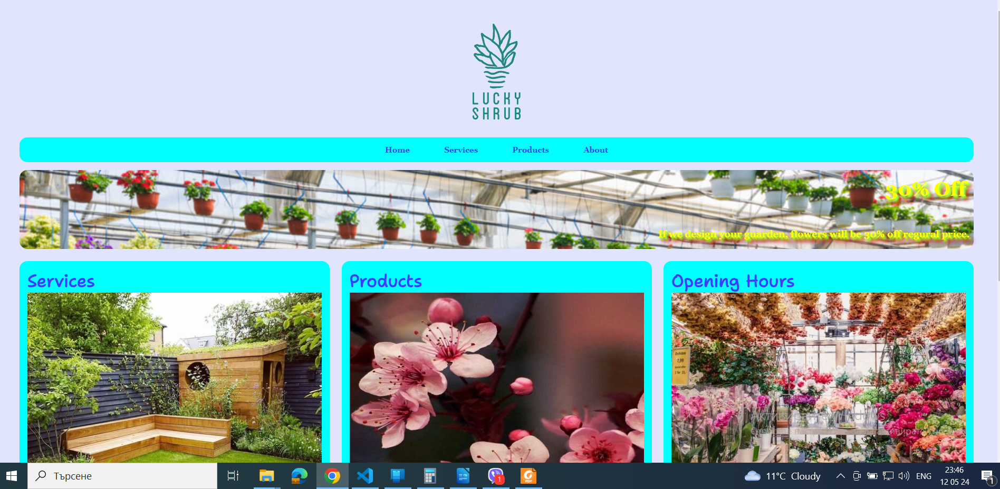

# CSS
My CSS Exersices.
In this repository I put all CSS projects and exercises which I have done during my education in the Meta course "HTML and CSS in depth".
A Hair Day Salon project:

A flower shop website named A Lucky Shrub:

